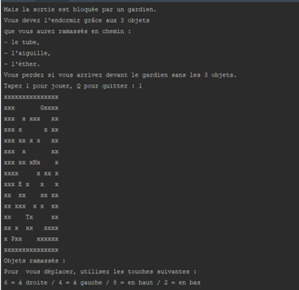
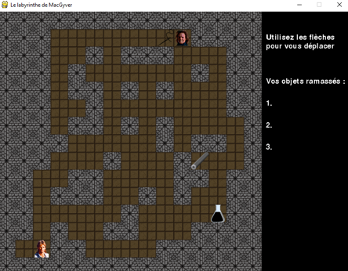

# Projet 3 - mars 2019
## Labyrinthe : Aidez MacGyver à s'échapper
			
**1. Scénario :**

	Pour s'échapper du labyrinthe, MacGyver doit se présenter devant le gardien
	avec les 3 objets qu'il aura ramassés.
	S'il manque un objet, c'est perdu !
	
**2. Installation des dépendances :**

	pip install -r requirements.txt
	
**3. Lancement du jeu :**

	- en mode terminal : **main.py**
	- en mode graphique : **main.py -g**
	
**4. Screenshot => ce que l'on voit :**

	- en mode terminal : 

	- en mode graphique : 

	
